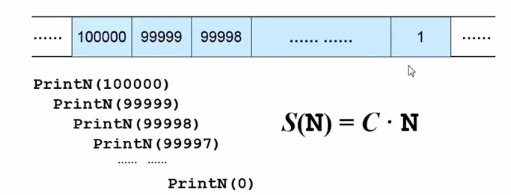
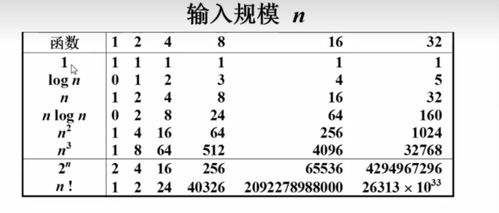
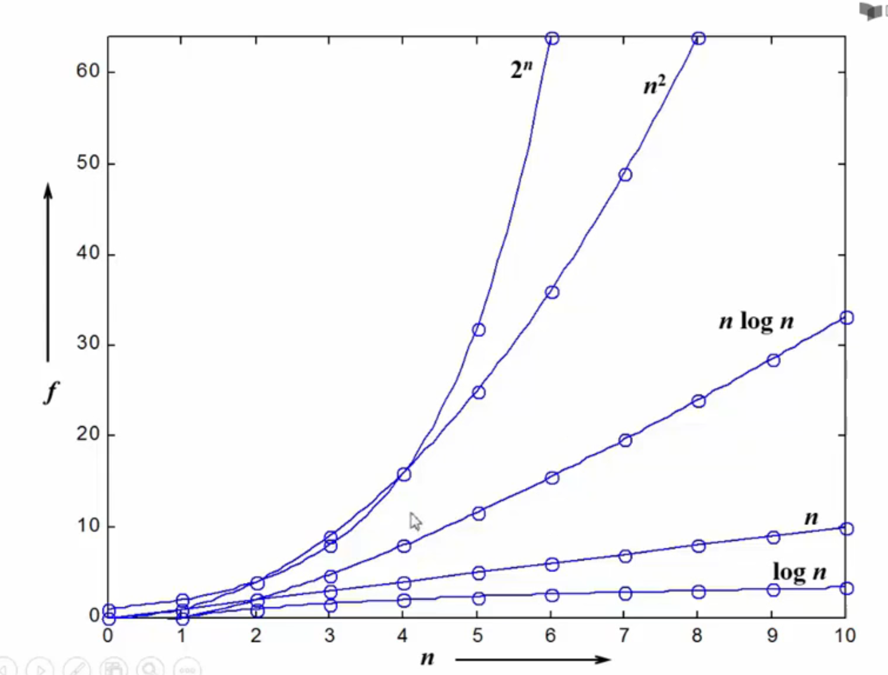
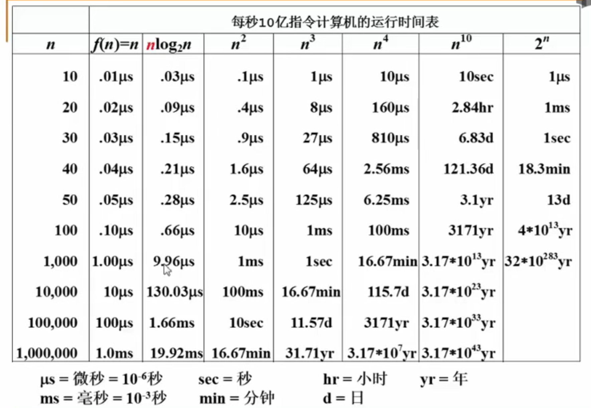

# 1.2 什么是算法？

## (1) 定义
**算法：**
- 一个有限的指令集
- 接受一些输入（有些情况下不需要输入）
- 产生输出
- 一定在有限步骤之后终止
- 每一条指令必须
  - 有充分明确的目标，不可以有歧义
  - 计算机能处理的范围之内
  - 描述应不依赖于任何一种编程语言以及具体的实现方式

**例1：** 选择排序算法的伪代码描述
```C
void SelectionSort(int List[],int N)
{
    for(i = 0; i < N ; i++>){
        MinPosition = ScanForMin(List,i,N-1);//从List[i]到List[N-1]中找到最小的元素，并将其赋值给MinPosition
        Swap(List[i],List[MinPosition]);//将未排序部分的最小元换到有序部分的最后位置
    }
}
```
---
## (2) 什么是好的算法？
- 空间复杂度$S(n)$ 
  - 占用存储单元的长度——与输入数据规模$n$有关
- 空间复杂度$T(n)$
  - 耗费时间的长度——与输入数据规模$n$有关
  
**例2：** PrintN递归调用的空间复杂度
```C
void PrintN(int N)
{
    if(N > 0){
        PrintN(N-1);
        printf("%d\n",N);
    }
}
```


**例3：** 求多项式定点值的时间复杂度
*方法：* 计算`*`出现的次数
```C
double f(int n,double a[],double x)
{
    int i;
    double p=a[0];
    for(i=1;i<=n;i++){
        p+=a[i]*pow(x,i);
    }
    return p;
}
```
**总共$(1+2+3+...+n) = \frac{n(n+1)}{2}$ 次乘法** 
$T(n) = C_1*n^2 + C_2*n$

```C
double f(int n,double a[],double x)
{
    int i;
    double p=a[n];
    for(i=n;i>0;i--){
        p=a[i-1]+x*p;
    }
    return p;
}
```
**总共$n$次乘法** 
$T(n) = C*n$

- 两种复杂度
  - 最坏情况复杂度 $T_{worst}(n)$（Better Choice）
  - 平均情况复杂度 $T_{avg}(n)$
  $T_{avg}(n) < T_{worst}(n)$

---
## (3) 复杂度的渐进表示法
### 一. 概念
- $T(n) = O(f(n))$ 表示存在常数C和$n_0$，使得当n>=$n_0$时，$T(n) <= C*f(n)$
- $T(n) = \Omega(g(n))$ 表示存在常数C和$n_0$，使得当n>=$n_0$时，$T(n) >= C*g(n)$
- $T(n) = \Theta(h(n))$ 表示同时有 $T(n) = O(h(n))$ 和 $T(n) = \Omega(h(n))$
  
==*Hint:通常 $O(n)$ 是最小的上界，$\Omega(n)$是最大的下界*==





### 二. 复杂度分析
- 若两段算法分别有复杂度$T_1(n)$和$T_2(n)$，则
  - $T_1(n) + T_2(n) = max(T_1(n),T_2(n))$
  - $T_1(n) * T_2(n) = T_1(n) + T_2(n)$
- 若$T(n)$是关于$n$的多项式，则$T(n) = \Theta(n^k)$
- 一个for循环的时间复杂度等于循环次数乘以循环体代码的复杂度
- if-else 结构的复杂度取决于if的条件判断复杂度和两个分支部分的复杂度，总体复杂度取三者中


