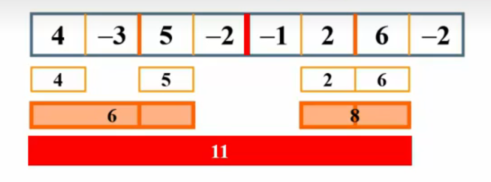

# 1.3 算法实例

## (1)最大子列和问题
题目：给定 $N$ 整数的序列 ${A_1,A_2,...,A_N}$,求最大子列和。即，对于任意给定的整数$K$与$1\leq i\leq j\leq N$，求函数 $f(i,j)=\operatorname{max}(0,\sum_{k=i}^jA_k)$ 的值
- **算法1：暴力算法**
``` C
int MaxSubseqSum1(int A[], int N)
{
    int ThisSum, MaxSum = 0;
    int i, j, k;
    for (i = 0; i < N; i++)
    {
        for (j = i; j < N; j++)
        {
            ThisSum = 0;
            for (k = i; k <= j; k++)
            {
                ThisSum += A[k];
            }
            if (ThisSum > MaxSum)
            {
                MaxSum = ThisSum;
            }
        }
    }
    return MaxSum;
}
```
*T(n) = O($N^3$)*

- **Promoted 暴力算法**
``` C
int MaxSubseqSum2(int A[], int N)
{
    int ThisSum, MaxSum = 0;
    int i, j;
    for (i = 0; i < N; i++)
    {
        ThisSum = 0;
        for (j = i; j < N; j++)
        {
            ThisSum += A[j];
            if (ThisSum > MaxSum)
            {
                MaxSum = ThisSum;
            }
        }
    }
    return MaxSum;
}
```
*T(n) = O($N^2$)*

- **算法3：分而治之**
An example:


$T(1) = O(1)$
$\begin{aligned}
T(n) &= 2T(\frac{N}{2})+cN \\
&= 2(2T(\frac{N}{4})+c\frac{N}{2})+cN \\
&= 2^kO(1)+ckN \\
&= O(N)+O(N\log N) \\
&=\, O(N\log N)\\
\end{aligned}$
其中 $\displaystyle\frac{N}{2^k}=1$

- **算法4：在线处理**
``` C
int MaxSubseqSum4(int A[], int N)
{
    int ThisSum, MaxSum = 0;
    int i;
    for (i = 0; i < N; i++)
    {
        ThisSum += A[i];//向右累加
        if (ThisSum > MaxSum)
        {
            MaxSum = ThisSum;//发现更大和则更新当前结果
        }
        else if (ThisSum < 0)//如果当前子列和为负
        {
            ThisSum = 0;//则不可能使后面的部分和增大，抛弃之
        }
    }
    return MaxSum;
}
```
*T(n) = O($N$)* 
**“在线”的意思是指每输入一个数据进行即时处理，在任何一个地方终止输入，都能得到正确的结果。**

