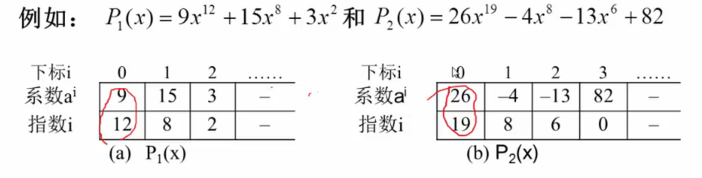
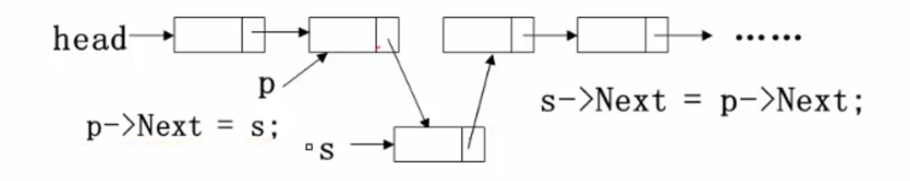
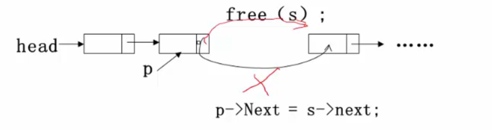
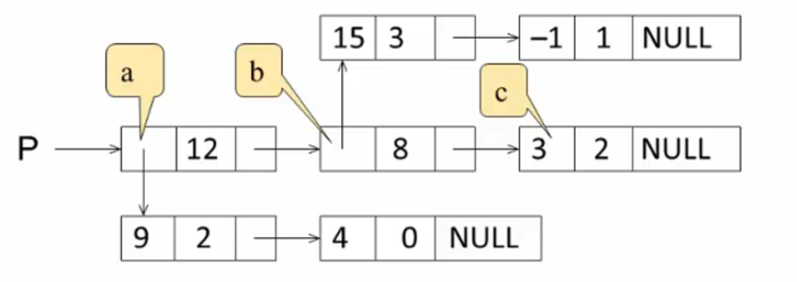
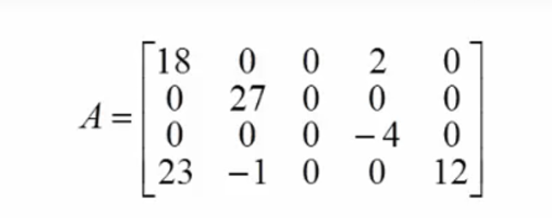
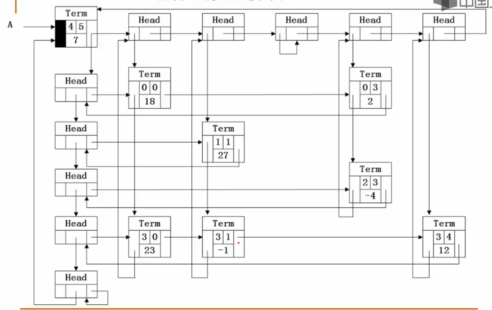

# 2.1 线性表及其实现
## 例1： 多项式的表示
一元多项式： $F(x) = a_0 + a_1x + a_2x^2 + ... + a_nx^n$
**主要运算**： 多项式相加、相乘、相减等
- 多项式的关键数据：
  - 项数n
  - 各项系数$a_i$即指数i
### 方法一：顺序存储结构直接表示
数组各分量对应多项式各项：
- `a[i]`项$x^i$的系数为$a_i$
*问题：表示多项式$x+3x^{2000}$? 巨大的时空浪费！*
---

### 方法二：顺序存储结构表示非零项
每个非零项 $a_ix^i$ 看成一个 $(a_i,i)$ 的二元组的集合
**用结构数组表示**


---
### 方法三：链表结构存储非零项
链表中每个结点存储一个非零项，包括系数和指数两个数据域和一个指针域
```c
struct PolyNode{
    int coef;
    int expon;
    Polynode* link;
};
```
具体详见Demo 2.1Polynomial.c

---
## 什么是线性表
**线性表**： 由同类型**数据元素**构成**有序序列**的线性结构
- 表中元素个数称为线性表的**长度**
- 线性表没有元素时称为**空表**
- 表起始位置称为**表头**，表结束位置称为**表尾**

---
## 线性表的抽象数据类型
类型名称： `List`
数据对象集： $D = \{a_1,a_2,...,a_n\}$，其中每个元素$a_i$的类型均为`ElementType`
操作集： 线性表 $L\in List$,元素 $X\in ElementType$
1. `MakeEmpty()`： 初始化一个空表
2. `Element FindKth(int K, List L)`： 返回线性表中第K个元素
3. `int Find(ElementType X, List L)`： 返回线性表中X第一次出现的位置
4. `void Insert(ElementType X, int i, List L)`： 在第i个位置插入X
5. `void Delete(int i, List L)`： 删除第i个位置的元素
6. `int Length(List L)`： 返回线性表的长度n


---
## 线性表的顺序存储实现
```c
#define MAXSIZE 1000
typedef int ElementType;
typedef struct LNode *List;
struct LNode{
    ElementType Data[MAXSIZE];
    int Last; // 表示线性表中最后一个元素的位置
};
struct LNode L;
List PtrL;
```
访问下标为i的元素： `L.Data[i]`或`PtrL->Data[i]`
线性表的长度： `L.Last+1`或`PtrL->Last+1`

*主要操作的实现：*
**1. 初始化**
```c
List MakeEmpty(){
    List PtrL;
    PtrL = (List)malloc(sizeof(struct LNode));
    PtrL->Last = -1;
    return PtrL;
}
```
**2. 查找**
```c
ElementType FindKth(int K, List PtrL){
    return PtrL->Data[K-1];
}
int Find(ElementType X, List PtrL){
    int i = 0;
    while(i <= PtrL->Last && PtrL->Data[i] != X)
        i++;
    if(i > PtrL->Last) return -1;
    else return i;
}
//*时间复杂度： $O(n)$*
```
**3. 插入(先移动，再插入)**
从最后一个元素按照从右往左的元素顺序移动，空出第i个位置
```c
void Insert(ElementType X, int i, List PtrL){
    int j;
    if(PtrL->Last == MAXSIZE-1){
        printf("表满");
        return;
    }
    if(i<1 || i>PtrL->Last+2){
        printf("位置不合法");
        return;
    }
    for(j=PtrL->Last; j>=i-1; j--)
        PtrL->Data[j+1] = PtrL->Data[j];
    PtrL->Data[i-1] = X;
    PtrL->Last++;
    return;
}
// *时间复杂度： $O(n)$*
```
**4. 删除(先删除，再移动)**
从第i+1个元素按照左往右移动，覆盖第i个位置
```c
void Delete(int i, List PtrL){
    int j;
    if(i<1 || i>PtrL->Last+1){
        printf("位置不合法");
        return;
    }
    for(j=i; j<=PtrL->Last; j++)
        PtrL->Data[j-1] = PtrL->Data[j];
    PtrL->Last--;
    return;
}
// *时间复杂度： $O(n)$*
```
---
## 线性表的链式存储实现
**不要求逻辑上相邻的两个元素物理上也相邻，通过“链”建立起数据元素之间的逻辑关系**
- 插入和删除不需要移动数据元素，只需要修改“链”
```c
typedef int ElementType;
typedef struct LNode *List;
struct LNode{
    ElementType Data;
    List Next;
};
struct LNode L;
List PtrL;
```

*主要操作的实现*
**1.求表长**
```c
int Length(List PtrL){
    List p = PtrL;
    int j = 0;
    while(p){
        p = p->Next;
        j++;
    }
    return j;
}
// *时间复杂度： $O(n)$*
```
**2.查找**
(1) 按序号查找
```c
List FindKth(int K, List PtrL){
    List p = PtrL;
    int i = 1;
    while(p!=NULL && i<K){
        p = p->Next;
        i++;
    }
    if(i == K) return p;
    else return NULL;
}
```
(2) 按值查找
```c
List Find(ElementType X, List PtrL){
    List p = PtrL;
    while(p!=NULL && p->Data != X)
        p = p->Next;
    return p;
}
```
**3.插入(在第$i-1(i\le i\le n+1)$)个结点后插入一个值为X的新结点**

```c
List Insert(ElementType X, int i, List PtrL){
    List p, s;
    if(i == 1){
        s = (List)malloc(sizeof(struct LNode));
        s->Data = X;
        s->Next = PtrL;
        return s;
    }
    p = FindKth(i-1, PtrL);
    if(p == NULL){
        printf("参数i错");
        return NULL;
    }else{
        s = (List)malloc(sizeof(struct LNode));
        s->Data = X;
        s->Next = p->Next;
        p->Next = s;
        return PtrL;
    }
}
```
**4.删除(删除第$i(i\le i\le n)$个结点)**

```c
List Delete(int i, List PtrL){
    List p, s;
    if(i == 1){
        s = PtrL;
        if(PtrL != NULL) PtrL = PtrL->Next;
        else return NULL;
        free(s);
        return PtrL;
    }
    p = FindKth(i-1, PtrL);
    if(p == NULL){
        printf("第%d个结点不存在", i-1);
        return NULL;
    }else if(p->Next == NULL){
        printf("第%d个结点不存在", i);
        return NULL;
    }else{
        s = p->Next;
        p->Next = s->Next;
        free(s);
        return PtrL;
    }
}
```
---
## 广义表
### 例2 二元多项式的表示
给定二元多项式：$P(x,y) = 9x^{12}y^2+4x^{12}+15x^8y^3-x^8y+3x^2$
**分析：将上述二元多项式看成关于x的一元多项式**
**$P(x,y)=(9y^2+4)x^{12}+(15y^3-y)x^8+3x^2$**


### 定义
- 广义表是线性表的推广
- 对于线性表而言，n个元素都是基本的单元素
- 广义表中，这些元素不仅可以是单元素，也可以是另一个广义表

```c
typedef struct GNode *GList;
struct GNode{
    int Tag; // 标志域，0表示单元素，1表示广义表
    union{   //子表指针域SubList和单元素数据域Data复用，即共用存储空间
        ElementType Data;
        GList SubList;
    }URegion;
    GList Next; // 指向后继结点
};
```
---
## 多重链表
**多重链表：链表中的节点同时隶属于多个链**
- 多重链表中节点的指针域不再是一个，而是多个
- 包含两个指针域的链表不一定是多重链表，如双向链表不是多重链表

### 例3 稀疏矩阵的表示——十字链表
**稀疏矩阵：矩阵中大部分元素为0**
- 只存储矩阵非0元素项
  - 节点的数据域：行坐标Row，列坐标Col，元素值Value
- 每个结点通过两个指针域，把同行同列串起来
  - 行指针Right
  - 列指针Down
eg. 
    
