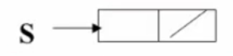
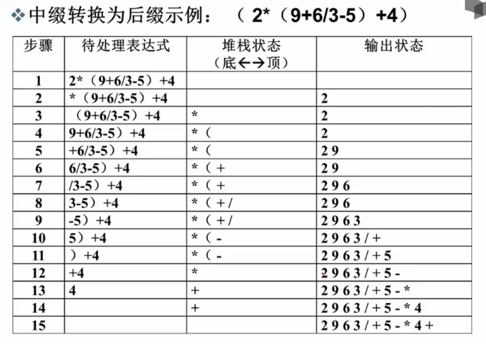

# 2.2 堆栈
## 什么是堆栈？
### 例1：计算机对表达式求值
算术表达式： `5+6/2-3*4 = 5+3-3*4 = 5+3-12 = 8-12 = -4`
- 由两类对象构成
  - 运算数：`5`、`6`、`2`、`3`、`4`
  - 运算符：`+`、`/`、`-`、`*`
- 不同运算符号优先级不一样
 
### 后缀表达式
- 中缀表达式：运算符号位于两个运算数中间，如`a+b*c-d/e`
- 后缀表达式：运算符号位于两个运算数之后，如`abc*+de/-`
eg. `62/3-42*+ = 33-42*+ = 042*+ = 08+ = 8`  

**后缀表达式求值策略**： 从左向右扫描，逐个处理运算数和运算符号
1. 遇到运算数：如何“记住”？
2. 遇到运算符号：如何对应运算数？

==需要一种顺序存储运算数并在需要时倒序输出的数据结构：堆栈==

---
## 堆栈的抽象数据类型描述
**堆栈(Stack)**:具有一定操作约束的线性表
- 只在一端(栈顶Top)进行插入和删除操作
   1. 插入操作：入栈(Push)
   2. 删除操作：出栈(Pop)
   3. 后入先出：Last In First Out(LIFO)
```c
// 堆栈的抽象数据类型描述
类型名称：堆栈(Stack)
数据对象集：一个有0个或多个元素的有穷线性表
操作集：对于一个长度为MaxSize的堆栈S ∈ Stack，以及任意元素X ∈ ElementType
    1. Stack CreateStack(int MaxSize)：生成空堆栈，其最大长度为MaxSize
    2. int IsFull(Stack S, int MaxSize)：判断堆栈S是否已满
    3. void Push(Stack S, ElementType item)：将元素item压入堆栈
    4. int IsEmpty(Stack S)：判断堆栈S是否为空
    5. ElementType Pop(Stack S)：删除并返回栈顶元素
```
---
## 栈的顺序存储实现
栈的顺序存储结构通常由一个**一维数组**和一个记录**栈顶元素位置**的变量组成
```c
#define MAXSIZE 100
typedef struct Snode *Stack;//c++中用using Stack = struct Snode*;代替
struct Snode{
    ElementType Data[MAXSIZE];
    int Top;
};
```
*用数组表示堆栈时，Top=-1表示堆栈为空，Top=MAXSIZE-1表示堆栈已满*

### 操作实现：
1. **创建堆栈**
```c
Stack CreateStack(int MaxSize){
    Stack S = (Stack)malloc(sizeof(struct Snode));
    S->Top = -1;
    return S;
}
```
2. **入栈**
```c
void Push(Stack S, ElementType item){
    if(S->Top == MAXSIZE-1){
        printf("堆栈满");
        return;
    }else{
        S->Data[++(S->Top)] = item;
        return;
    }
}
```
3. **出栈**
```c
ElementType Pop(Stack S){
    if(S->Top == -1){
        printf("堆栈空");
        return ERROR;
    }else{
        return (S->Data[(S->Top)--]);
    }
}
```

### 例2：用一个数组实现两个堆栈，要求最大利用数组空间
- 分析：两个堆栈分别从数组两端向中间生长
```c
#define MAXSIZE 100
struct DStack{
    ElementType Data[MAXSIZE];
    int Top1=-1;
    int Top2=MAXSIZE;
};
//Push
void Push(struct DStack *PtrS, ElementType item, int Tag){
    if(PtrS->Top2 - PtrS->Top1 == 1){
        printf("堆栈满");
        return;
    }
    if(Tag == 1){
        PtrS->Data[++(PtrS->Top1)] = item;
    }else if(Tag == 2){
        PtrS->Data[--(PtrS->Top2)] = item;
    }
    return;
}
//Pop
ElementType Pop(struct DStack *PtrS, int Tag){
    if(Tag == 1){
        if(PtrS->Top1 == -1){
            printf("堆栈1空");
            return ERROR;
        }else{
            return (PtrS->Data[(PtrS->Top1)--]);
        }
    }else if(Tag == 2){
        if(PtrS->Top2 == MAXSIZE){
            printf("堆栈2空");
            return ERROR;
        }else{
            return (PtrS->Data[(PtrS->Top2)++]);
        }
    }
}
```
---
## 栈的链式存储实现
栈的链式存储结构实际上就是一个**单链表**，叫做**链栈**。插入和删除操作只在链栈的栈顶进行
*思考：为什么栈顶指针Top只能在链表头？*
- 分析： 栈顶指针若在链尾，则无法进行出栈操作，因为无法找到前一个结点（单链表）
```c
typedef struct Snode *Stack;
struct Snode{
    ElementType Data;
    Stack Next;
};
```
### 操作实现：
1. **创建堆栈（建立空栈）**
```c
Stack CreateStack(){
    Stack S = (Stack)malloc(sizeof(struct Snode));
    S->Next = NULL;
    return S;
}//构建一个堆栈的头结点，返回指针
```
生成一个如下结构：


2. **判断是否为空**
```c
int IsEmpty(Stack S){
    return (S->Next == NULL);
}
```

3. **入栈**
```c
void Push(Stack S, ElementType item){
    Stack TmpCell = (Stack)malloc(sizeof(struct Snode));
    TmpCell->Data = item;
    TmpCell->Next = S->Next;
    S->Next = TmpCell;
    return;
}
```

4. **出栈**
```c
ElementType Pop(Stack S){
    Stack FirstCell;
    ElementType TopElem;
    if(IsEmpty(S)){
        printf("堆栈空");
        return ERROR;
    }else{
        FirstCell = S->Next;
        TopElem = FirstCell->Data;
        S->Next = FirstCell->Next;
        free(FirstCell);
        return TopElem;
    }
}
```

---
## 堆栈应用： 表达式求值
**基本策略：** 将中缀表达式转换为后缀表达式，然后求值
1. 运算数相对顺序不变
2. 运算符号顺序发生改变
   - 需要存储“等待中”的运算符号
   - 要将当前运算符号与“等待中”的最后一个运算符比较，若当前优先级小于最后一个运算符，则输出最后一个运算符
   - *$T(N)=O(N)$*

### 总结：中缀表达式如何转换为后缀表达式
- 从头到尾读取中缀表达式的每个对象，对不同对象按不同的情况处理。
1. **运算数**：直接输出
2. **左括号**：压入堆栈
3. **右括号**：将栈顶的运算符弹出并输出，直到遇到左括号（出栈但不输出）
4. **运算符**：
   - 若优先级大于栈顶运算符，则压入堆栈
   - 若优先级小于等于栈顶运算符，则将栈顶运算符弹出并输出，再比较新的栈顶运算符，直到该运算符大于栈顶运算符优先级为止，然后将该运算符压入堆栈
5. 若各对象处理完毕，则将堆栈中存留的运算符依次弹出并输出
6. 
**eg.**

### 堆栈的其他应用
- 函数调用及递归实现
- 深度优先搜索
- 回溯算法